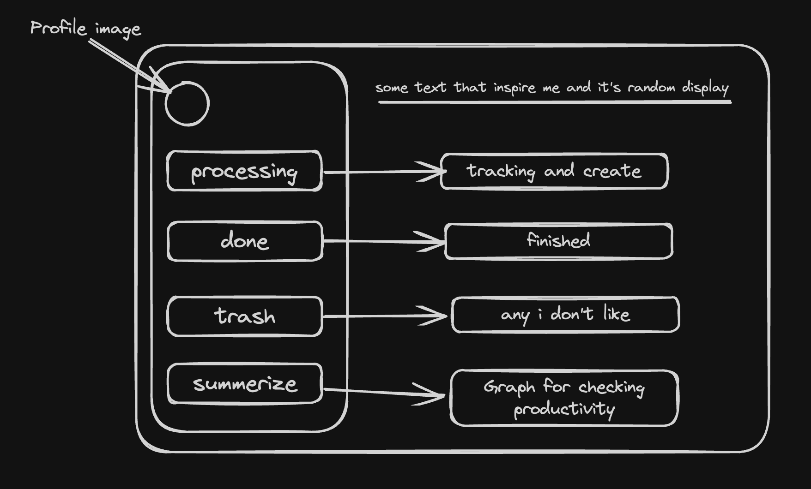

started
 - from make a task application by using `postgres` , `nextjs` , `prisma` , `nextAuth` , `zustand`
### task feature
1. dead line
2. tracking processing
3. warned time
4. urgent !
 
---

not start yet but will start **soon**

